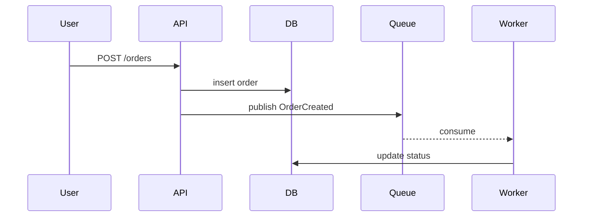

# show-me

## Principle

Pick the smallest view that makes the key point clear. Skip the preamble;
keep prose to one or two lines around each view. You may use one view,
sometimes two; never all. Every view is a fenced code block (or Mermaid
block) inline in the reply — nothing is saved, rendered to HTML, or opened.

## View catalog

Pick one row unless a second genuinely adds a different axis (e.g. call
tree + diff). Use real identifiers from the code under discussion.

**Pseudocode** — logic or algorithm:
```text
retry(fn, maxAttempts=3):
  for attempt in 1..maxAttempts:
    try: return fn()
    catch e:
      if attempt == maxAttempts: raise e
      sleep(backoff(attempt))
```

**Call tree** — runtime control flow:
```text
handleRequest()
├─ authenticate()
│  └─ verifyToken()
├─ loadUser(id)
│  └─ db.query("users")
└─ renderResponse()
```

**Component tree** — UI structure; only the state/boundaries that matter:
```text
<CheckoutPage>
├─ <CartSummary items={cart.items} />
├─ <AddressForm onSubmit={setAddress} />   state: address
└─ <PaymentButton disabled={!address} />   boundary: <Suspense>
```

**File tree** — responsibilities or a large refactor; shallow, one level:
```text
src/
├─ auth/      # login, token refresh
├─ billing/   # invoices, webhooks
└─ shared/    # types, http client
```

**Mermaid** — interactions between parts, 9 nodes or fewer; fine here
since chat renders it live and nothing is stored. Pick the form by what
the reader must see (`writeup-kit/references/writing.md` §4, the same
question the kit's figure types answer): flow or time → `sequenceDiagram`,
structure → `flowchart LR`, state → `stateDiagram-v2`:


**Diff by shape** — four shapes; show the whole block only when most of
it is new, omitted context would hide ownership/order, or the user needs
a copyable target shape:

Component diff:
```diff
- <UserCard user={user} />
+ <UserCard user={user} onEdit={openEditModal} />
```

File-layout diff:
```diff
  src/
- ├─ utils.ts
+ ├─ utils/
+ │  ├─ date.ts
+ │  └─ string.ts
```

Call-stack diff:
```diff
  handleSubmit()
- └─ validate(form)
+ ├─ validate(form)
+ └─ sanitize(form)
```

State-flow diff:
```diff
- idle -> loading -> success
+ idle -> loading -> success -> stale (revalidate on focus)
```

Full when/when-not guidance, templates, and a worked Japanese example
per view: `references/views.md`.

## Escalation rule

Denser than ~9 nodes, or the user asks to keep it → hand off instead of
stretching the view: a keepable page uses the `writeup` skill (kind 設計
or 作業メモ); a beginner-facing picture uses `eli5`. Do not write ad-hoc
HTML files for a show-me answer and do not `open` files from this skill.
Rare exception: structure too dense for text/Mermaid but not yet worth a
full page — the `writeup-kit` renderer (`../writeup-kit/bin/render-diagram.mjs`)
can produce a standalone SVG figure to inline: choose the type with the
`writing.md` §4 rule, confirm it with `--list-types`, take the IR shape
from `--doc <type>`, render with `--figure`; trim the view first before
reaching here.

## Guidance

Place each view next to the one line of prose it supports. Include only
the calls, files, props, states, or boundaries needed for the current
question — cut everything else, even if it exists. Prefer real
identifiers from the code over invented names. Prose in Japanese when the
conversation is Japanese; identifiers and paths stay as-is.

## Common Mistakes

- Showing three views when one would have made the point.
- A Mermaid graph with 15 nodes — that's a `writeup` figure, not show-me.
- Inventing file or function names instead of using the real ones.
- Trimming a diff so far it omits the line that answers the question.
- Opening an HTML file or writing one to disk for what should be a code
  block in the reply.
