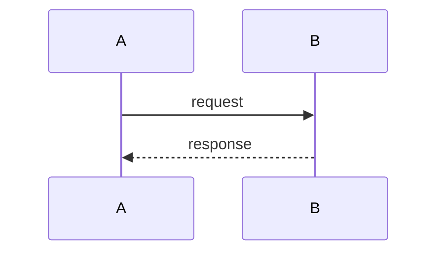
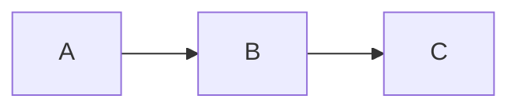
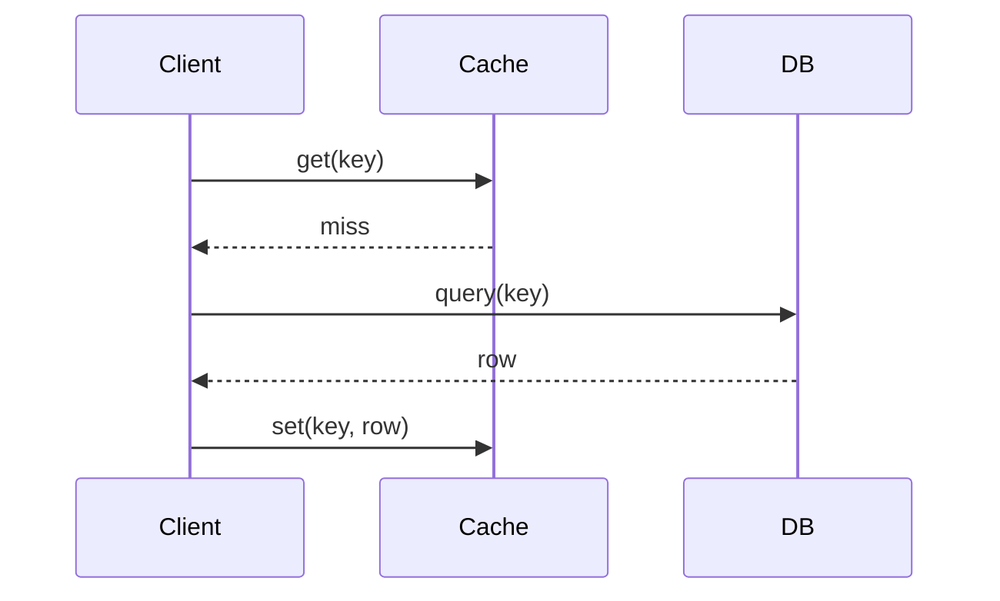

# show-me: view catalog (full reference)

Detail behind each row of SKILL.md's catalog: when to reach for the view,
when not to, a template, and one worked example. Prose in the examples is
Japanese (matching how these come up in a real conversation); identifiers
stay as-is per the skill's own rule.

## Pseudocode

**When**: the question is "what's the logic/algorithm here" — a
transformation, a branch structure, a sequence of decisions independent
of any specific language's syntax.

**When not**: the actual runtime call sequence is the point (use call
tree instead) — pseudocode shows *what the code decides*, not *what
calls what*.

**Template**:
```text
functionName(args):
  <setup>
  for/while <condition>:
    <decision>
    <action>
  return <result>
```

**Example** — "このデバウンス処理、何してるか一言で見せて":
```text
debounce(fn, wait):
  pending = null
  return (...args) =>
    clear(pending)
    pending = setTimeout(() => fn(...args), wait)
```
一言："呼ばれるたびタイマーをリセットし、wait ms 呼ばれなかった時だけ実行する"

## Call tree

**When**: "実行時にどこを通るか見せて" — tracing what a request or
function call actually invokes, in order, including which branches fire.

**When not**: the static file/module structure is the point (use file
tree) — a call tree is about *runtime order*, not *where things live*.

**Template**:
```text
entryPoint(args)
├─ step1()
│  └─ helper()
├─ step2()      # only if <condition>
└─ step3()
```

**Example** — "ログイン失敗した時、どこまで進んで落ちてる？":
```text
login(email, password)
├─ validateInput(email, password)   OK
├─ findUser(email)                  OK
├─ verifyPassword(hash, password)   FAIL → throws InvalidCredentials
└─ issueSession()                   never reached
```

## Component tree

**When**: "この画面のコンポーネント構造どうなってる？" — UI composition,
where state lives, where a Suspense/Error boundary sits.

**When not**: don't dump every prop — only the ones relevant to the
question (e.g. why a button is disabled, why a child re-renders).

**Template**:
```text
<Parent>
├─ <ChildA prop={value} />          state: <name>
└─ <ChildB />                        boundary: <ErrorBoundary>
```

**Example** — "なんで保存ボタンが押せないのか構造で見せて":
```text
<SettingsPage>
├─ <ProfileForm onChange={setDirty} />   state: dirty, errors
└─ <SaveButton disabled={!dirty || errors.length > 0} />
```
`errors` が空になっていない = バリデーション側の問題。

## File tree

**When**: "このリファクタどこに何を分けるか見せて" — responsibilities
across a directory, before/during a large restructure.

**When not**: don't go more than 1-2 levels deep, and don't list every
file — comment the *responsibility* of a directory, not its contents.

**Template**:
```text
src/
├─ moduleA/   # <responsibility>
└─ moduleB/   # <responsibility>
```

**Example** — "認証まわり、今どこに散らばってる？":
```text
src/
├─ api/auth.ts        # login/logout エンドポイント
├─ lib/jwt.ts         # トークンの署名・検証
├─ hooks/useAuth.ts   # クライアント側のセッション状態
└─ middleware/auth.ts # ルートガード
```

## Mermaid

**When**: the point is *interaction between parts* — who calls whom,
what messages cross a boundary, an async handoff. Chat renders Mermaid
live, so it's the one view here that's a real diagram instead of text.
Choose the Mermaid form the way the kit chooses a figure type — by what
the reader must see faster than prose (`writeup-kit/references/writing.md`
§4): flow or time → `sequenceDiagram`, structure → `flowchart LR`, state →
`stateDiagram-v2`. Quantities and comparisons are not a Mermaid job here —
a short table in the reply, or a kit `bar` / `matrix` figure if it must
be kept.

**When not**: more than ~9 nodes (split the question, or escalate to
`writeup`'s figure pipeline instead — that's a keepable diagram, this
is a disposable one; there the same question maps to one of the kit's
types via `render-diagram.mjs --list-types`). Also skip it for pure logic
(use pseudocode) or pure structure with no interaction (use a tree).

**Template**:

or


**Example** — "キャッシュミス時の流れ見せて":


## Diff by shape

Four distinct things people ask "何が変わった？" about. Each wants a
different shape of diff — don't force a code diff to answer a structure
question or vice versa. Show the full block when most of it changed,
when omitted context would hide ownership/order, or when the user needs
a copyable target; otherwise trim to the changed line plus one line of
anchor context on each side.

### Component diff
Props/composition changing on a UI component.
```diff
- <OrderRow order={order} />
+ <OrderRow order={order} onCancel={cancelOrder} highlighted={isNew} />
```

### File-layout diff
A module being split, moved, or renamed.
```diff
  src/
- ├─ api.ts
+ ├─ api/
+ │  ├─ orders.ts
+ │  └─ users.ts
```

### Call-stack diff
A new step inserted into, or removed from, a call sequence.
```diff
  submitOrder(order)
- ├─ validate(order)
- └─ save(order)
+ ├─ validate(order)
+ ├─ reserveInventory(order)
+ └─ save(order)
```

### State-flow diff
A state machine or lifecycle gaining/losing a transition.
```diff
- draft -> submitted -> approved
+ draft -> submitted -> approved -> archived (after 90d)
+ draft -> submitted -> rejected -> draft (resubmit)
```
