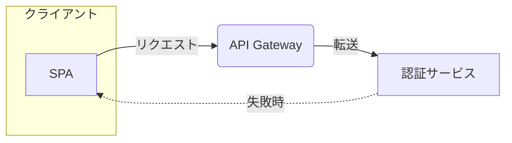

# Input from Markdown (`--from <md> --kind <kind>`)

Used for turning a workflow's Markdown report (research / design-review /
acceptance / deliberate) — or any Markdown the user hands over — into a
writeup page. Read the file, map it with the table below, then continue
at `SKILL.md` step 3 (write the body into the copied template, render
figures, lint, self-check, save, commit). This is the mirror image of
the kit's own `to-md.mjs` mapping (`$KIT/references/page-contract.md`
§7) — reading that table backwards is a useful cross-check.

## Markdown → component mapping

| Markdown | `.wu-*` component |
|---|---|
| `# Title` (the document's H1) | `<title>` / `.wu-header`'s `<h1>` |
| First paragraph before any heading | `.wu-lede` (trim to one paragraph) |
| `> [!NOTE]` blockquote | `.wu-summary` if it's the opening 3-5 line overview, otherwise `.wu-callout` `data-tone="note"` |
| `> [!WARNING]` blockquote | `.wu-callout` `data-tone="warn"` |
| `> [!IMPORTANT]` blockquote | `.wu-callout` `data-tone="decision"`, or `.wu-decision` if it has the decision/trade-off/basis shape below |
| A plain `>` blockquote with a source line | `.wu-quote` (original / translation / source) |
| `##` / `###` / `####` | `.wu-section > h2` / `h3` / `h4` |
| `- **name** — definition` list (3+ items) | `.wu-terms` (`<dl>`) |
| `- **決定**: … / 重視した得失: … / 根拠: …` block | `.wu-decision` |
| GFM table, ≤4 columns, rows = options judged on the same axes | `.wu-compare` |
| GFM table, otherwise (≤5 columns) | `.wu-table` |
| Numbered list where order matters | `.wu-steps` (`<ol>`) |
| Bullet list of short parallel tags (3-6 items) | `.wu-chip` |
| ` ```lang ` fenced code | `.wu-code` `data-lang="lang"` |
| ` ```diff ` fenced code | `.wu-diff` |
| ` ```mermaid ` fenced code | Diagram IR — see below, wrapped in `.wu-figure` after a successful `render-diagram.mjs` run |
| Trailing footnote `[^n]` / a `path:line` reference right after a claim | `.wu-meta` |
| A closing "open questions" / "risks" / "assumptions" section | `.wu-open` |
| `**bold**` used once, marking the single takeaway | `.wu-accent` (never a second occurrence — see `SKILL.md` Common Mistakes) |

Anything left over that doesn't fit a row above (an image, an HTML block,
a nested list deeper than the kit's structure) gets rewritten as plain
prose inside the nearest `.wu-section` — never invent a new component.

## mermaid → diagram IR rules

writeup's IR (contract §4-1) is a narrow subset of what mermaid
flowcharts can express. Convert what fits; **when the mermaid is richer
than the subset, keep the overall structure and explicitly note what was
lost** (in your reply to the user, not silently in the page) — do not
refuse the conversion outright.

1. Only `flowchart`/`graph` mermaid diagrams convert automatically.
   Sequence diagrams, state diagrams, and Gantt charts have no IR
   equivalent — describe them in prose or `.wu-table` instead.
2. `flowchart TD` / `TB` → IR `direction: down`. `flowchart LR` → IR
   `direction: right`. Mermaid's `RL`/`BT` have no IR equivalent — pick
   the closer of `right`/`down` and note the flip.
3. A bare node token (`spa`) or any shape syntax (`spa[SPA]`,
   `spa(SPA)`, `spa((SPA))`, `spa{SPA}`) becomes an IR node
   `{id: spa, label: "SPA"}` — **the shape itself is lost**; IR nodes
   have no shape field, only `tone`/`dashed`/`emphasis`.
4. `subgraph name[Label] ... end` becomes an IR group
   `{id: name, label: "Label"}`; nodes declared inside it get
   `group: name`. Nesting deeper than one subgraph level has no IR
   equivalent (groups nest ≤1 level) — flatten the inner subgraph and
   note the flattening.
5. Edge lines `A --> B`, `A -->|label| B`, and `A -- label --> B` all
   become an IR edge `{from: A, to: B, label: "label", kind: sync}`.
   `A -.-> B` / `A -.->|label| B` (dotted) become `kind: reply`. A thick
   edge (`A ==> B`) has no IR equivalent — convert it as `kind: sync` and
   note that the emphasis-by-thickness was lost (use a node's
   `emphasis: true` instead if the intent was "this path matters").
6. An edge label over 12 characters must be shortened to fit the IR
   budget (`edges[].label` ≤ 12 chars) — paraphrase, don't truncate mid-word.
7. mermaid carries no page-level `title`/`caption` for the figure — write
   both yourself from the surrounding Markdown heading or paragraph, or
   ask the user for a one-sentence caption if nothing nearby fits.
8. If the mermaid exceeds the IR's own budgets (9 nodes / 12 edges / 4
   groups), don't invent a split on your own — run it through
   `render-diagram.mjs` anyway; exit 2 will hand back a concrete `split:`
   suggestion naming which group or node to peel off.

## Worked example

Source Markdown fragment:



Converted IR (title/caption authored from the surrounding paragraph,
since mermaid carries neither):

```yaml
id: d1
title: 認証リクエストの経路
caption: SPA は API Gateway 経由で認証サービスを呼び、失敗時だけ直接返る
direction: right
groups:
  - id: client
    label: クライアント
nodes:
  - id: spa
    label: SPA
    group: client
  - id: gw
    label: API Gateway
  - id: svc
    label: 認証サービス
edges:
  - from: spa
    to: gw
    label: リクエスト
    kind: sync
  - from: gw
    to: svc
    label: 転送
    kind: sync
  - from: svc
    to: spa
    label: 失敗時
    kind: reply
```

Loss to report to the user: mermaid distinguished node shapes
(`spa`/`svc` as rectangles, `gw` as a rounded box) to hint at their
roles — the IR has no shape field, so all three render as the same plain
node shape. Nothing else was lost; the diagram is well within budget (3
nodes, 3 edges, 1 group). Run this through `render-diagram.mjs --json`
per `SKILL.md` step 3 before pasting it into the page.
