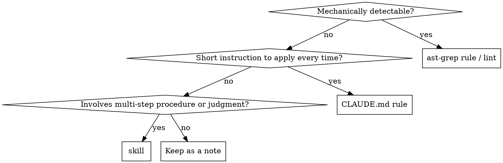

# Retrospective Codify

Near the end of a task, extract the insight "had I known this at the start, I would not have taken the detour" and pin it as a static rule, a skill, or an always-on rule. Prefer a form that reproduces without relying on the prompt.

## When to use

- Just before a task completes, or when the user says 「学びを残して」「ルール化して」
- When the solution came after trial and error (stuck on the first move, a wrong hypothesis, time burned on missing docs, etc.)
- When the same kind of task is likely to recur

Do not use for:
- A simple task that passed first time (nothing to extract)
- A one-off, project-specific fix (the commit message is enough)

## Workflow

1. **Pair failure ⇄ success**: write out three things from this task.
   - The first attempt (what was done / how it failed)
   - The final solution (what worked)
   - The bridging insight (why the first attempt fell short)
2. **Phrase "what should have been known first"**: summarize the insight in 1–3 sentences. Not a recollection but an instruction to future you ("do not ..." / "check ... first").
3. **Classify**: choose the destination from the decision table below.
4. **Duplicate check (mandatory)**: compare against existing knowledge before proposing. If a duplicate or near rule exists, choose "append to / update existing" rather than "add new". Skipping this bloats skills and rules.

   Pull 2–3 search keys from the insight (tool names, API names, symptom words, antonyms). Example: for the insight "use pnpm v10", `pnpm`, `packageManager`, `lockfile`.

   Where to check and the minimum searches:
   ```
   # skill duplicates (global)
   ls ~/.claude/skills/
   Grep "<key>" ~/.claude/skills/*/SKILL.md

   # CLAUDE.md duplicates
   Grep "<key>" ~/.claude/CLAUDE.md
   Grep "<key>" <project-root>/CLAUDE.md   # when a relevant project exists

   # lint rule duplicates
   ls <project-root>/rules/
   Grep "<key>" <project-root>/rules/
   ```

   Sort the result into 4 classes:
   - **New**: no hits → propose as usual
   - **Append to existing**: a related skill/rule exists and the new information complements it → propose "append to existing"
     - "Partial duplicate" (part of the learning is already covered, the rest is new) belongs here too. Put the duplicated part under "Duplicates detected" and the new part under "Candidates" (`[skill append]` or `[rule]`).
   - **Duplicate of existing (no proposal)**: the existing item already covers the same insight completely → zero proposals, but keep a "Duplicates detected" line in the presentation (for auditability). Cite the existing skill name + section name (or line number) as evidence.
   - **Undecided**: the agent cannot tell whether it is a duplicate → show the comparison to the user and ask
5. **Write out**: generate the artifact following the template for the chosen form (below).
6. **Confirm**: show the user the diff and get a yes/no. If rejected, keep it as an in-session note, not a skill.

## Classification



| Criterion | Destination | Example |
|---|---|---|
| Detectable at the syntax level of code/config | `ast-grep` rule or existing linter config | "Do not use `Array.from(set).length`, use `set.size`" |
| Short, always applied, no judgment involved | `CLAUDE.md` (user global / project) | "Use pnpm v10 or later" |
| Needs a procedure, contextual judgment, or a template | New skill or append to an existing skill | "How to write a MoonBit C binding" |
| Project-specific and one-off | Do not adopt (leave in the commit message / PR description) | — |

**Prefer ast-grep**: anything statically detectable goes into an `ast-grep` rule, never into prompts or docs (the user's global rule).

**Where CLAUDE.md entries go**:
- General rules across languages and tools → `~/.claude/CLAUDE.md`
- Limited to one repository → that repository's `CLAUDE.md`

## Output templates

### ast-grep rule
Add a YAML under `rules/` and always write a valid / invalid pair under `rule-tests/`.

### CLAUDE.md append
```markdown
# <append to an existing section>
- <one imperative sentence> (reason: <short rationale>)
```
Always attach the reason in parentheses (so future you can judge edge cases).

### New skill
Follow the minimal template of the `writing-skills` skill:
```markdown
---
name: <kebab-case>
description: Use when <concrete situation> / <symptom>
---

# <Title>

## Purpose
## When to use
## Workflow
## Pitfalls
```

## Examples

### Example 1: ast-grep rule (mechanically detectable)

- First attempt: got a set's size in TypeScript with `Array.from(set).length`; review flagged it as inefficient.
- Final solution: use `set.size`.
- Insight: use the `.size` property for `Set` / `Map` sizes. `Array.from(...).length` is detectable at the syntax level.

→ Add `rules/no-array-from-size.yml`:
```yaml
id: no-array-from-size
language: TypeScript
severity: warning
rule:
  pattern: Array.from($COLL).length
message: Use the .size property for Set/Map sizes.
```

### Example 2: CLAUDE.md rule (short, always-on)

- First attempt: ran `pnpm install`; CI failed on a lockfile-format diff.
- Final solution: aligned pnpm to the v10 line.
- Insight: pnpm's lockfile changes across versions. Always use v10 or later.

→ Append to the "Tools" section of `~/.claude/CLAUDE.md`:
```markdown
- Use pnpm v10 or later (reason: the lockfile format is incompatible with v9 and earlier, causing CI diffs)
```

### Example 3: new skill (procedure + judgment)

- First attempt: tried several ways to call a C library from MoonBit and got stuck on FFI declarations and stub placement.
- Final solution: the combination of `extern "c"` declarations + a stub using `moonbit.h` + the `native-stub` / `link.native` settings in `moon.pkg.json`.
- Insight: it does not fit a single step; the three layers — declaration, stub, build config — must be understood together.

→ Split out the procedure and templates as a new skill `moonbit-c-binding` (it already exists, so this example is the case where the duplicate check chooses "append to existing").

## Red flags (watch for rationalizations)

Stop once when any of these thoughts appear.

| Rationalization | Reality |
|---|---|
| "It's project-specific, but let's make a skill just in case" | Skills bloat and become hard to find. The commit message / PR is enough. |
| "Skip the approval and write it out first; show it later" | Silently changing CLAUDE.md / skills makes future behavior unpredictable. Always propose → approve → write. |
| "It could be ast-grep, but a natural-language rule is faster" | Prose rules for statically detectable things do not get followed. Prefer ast-grep. |
| "The insight is thin, but I should write something to save face" | Zero proposals is a valid answer. An empty retrospective does no harm. |
| "The duplicate check is tedious; delete later if it overlaps" | Lingering duplicate rules split behavior. Dedup is a mandatory step. |
| "Leave out the failure side; just write the final solution" | Without the failure written down, future you falls into the same pit again. |

## Presentation format for the user

At the end of the task, present the stocktake in this form. **Multiple learnings are fine. List duplicates and rejections explicitly too, to leave a trail of the decision.** Write the presentation in the conversation language (this harness: Japanese); keep the structure below.

```
## Retrospective

### Learning 1: <short label>
- First failure: <1 line>
- Final solution: <1 line>
- Insight: <1 line>

### Learning 2: <short label>      # omit this block when there is only one learning
- First failure: <1 line>
- Final solution: <1 line>
- Insight: <1 line>

## Proposals

Candidates:
- [lint] <rule name>: <1 line> (artifact: <path>, from learning N)
- [skill append] <existing skill name>: <1 line> (from learning N)
- [skill new] <skill name>: <1 line> (from learning N)
- [rule] CLAUDE.md (global/project): <1 line> (from learning N)

Duplicates detected (no proposal):
- <learning N>: fully covered by <section name or line number> of existing <skill/rule name> → nothing added

Rejected:
- <learning N>: <1-line reason> (e.g. project-specific / cross-file, hard to express as lint / absorbed into another learning)

Tell me which to adopt, by number or item name. Zero proposals is also a valid conclusion.
```

**Format rules:**
- With a single learning, drop the `### Learning N` heading and write one Retrospective block only
- If any of "Candidates", "Duplicates detected", "Rejected" is empty, omit that section entirely (never write a "none" line)
- End every proposal line with "from learning N" (across several learnings, list them: "from learning 1, 3")
- When "Candidates" is empty and only "Duplicates detected" remains, replace the closing line `Tell me which to adopt` with `No candidates. Review for the record only.`
- Write out only the items the user chose to adopt. Never write silently

### Presentation example: every learning already covered (duplicates only)

```
## Retrospective

### Learning 1: <label>
- First failure: ...
- Final solution: ...
- Insight: ...

## Proposals

Duplicates detected (no proposal):
- Learning 1: fully covered by `<section name>` of existing skill `<skill name>` → nothing added

No candidates. Review for the record only.
```

### Presentation example: partial duplicate (append to existing + duplicate detected)

```
## Proposals

Candidates:
- [skill append] <existing skill name>: <1 line for the new part> (from learning 1, complements existing section `<section name>`)

Duplicates detected (no proposal):
- Learning 1 (the version-value part): already covered by the Tools section of `~/.claude/CLAUDE.md` → no append needed
```

## Common mistakes

- **Too fine-grained**: turning one-time details (a specific function name, a specific version) into a rule → abstract up to the level of "what to check"
- **Defaulting to prose**: writing a statically detectable rule in natural language in CLAUDE.md → move it to an `ast-grep` rule
- **No reason written**: the rationale is lost and future you cannot judge why to follow it → always attach `Why:`
- **Writing without asking**: updating CLAUDE.md or a skill without user approval → always keep the order propose → approve → write
- **Skipping the failure description**: writing only "the final solution is X" without why the first move got stuck → without the failure side, future you falls into the same pit again

## Related skills

- `writing-skills` — template and TDD flow for writing a new skill
- `update-config` — when settings.json / permissions need changing
- Automatic detection is the `prompt:correction-detect` UserPromptSubmit hook + `/learn`; the manual stocktake is this skill
